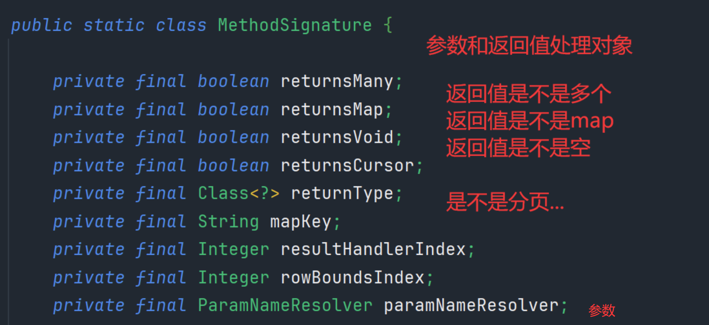

# 第一章：回顾

## 1. 课程中工具的版本

```plain
1. JDK8
2. IDEA2018.3
3. Maven3.5.3
4. MySQL 5.1.48 --> MySQL 5
   Mybatis 3.4.6
```

## 2. Mybatis开发的简单回顾

```plain
1. Mybatis做什么？
   Mybatis是一个ORM类型框架，解决的数据库访问和操作的问题，对现有JDBC技术的封装。
2. Mybaits搭建开发环境 
   1. 准备jar
     <dependency>
        <groupId>org.mybatis</groupId>
        <artifactId>mybatis</artifactId>
        <version>3.4.6</version>
     </dependency>
     <dependency>
       <groupId>mysql</groupId>
       <artifactId>mysql-connector-java</artifactId>
       <version>5.1.48</version>
     </dependency>
   2. 准备配置文件
      a. 基本配置文件 mybatis-config.xml
         1. 数据源的设置 <environments/>
         2. 类型别名
         3. mapper文件的注册
      b. Mapper文件
         1. DAO规定方法的实现 --> SQL语句 
   3. 初始化配置 
      在mybatis-config.xml文件中配置 environment
3. 开发步骤 7步
   1. entity
   2. 类型别名
   3. table 
   4. DAO接口
   5. Mapper文件
   6. Mapper文件的注册
   7. API编程
```
### 配置文件  mybatis-config.xml

```xml
<?xml version="1.0" encoding="UTF-8" ?>
<!DOCTYPE configuration PUBLIC "-//mybatis.org//DTD Config 3.0//EN" "http://mybatis.org/dtd/mybatis-3-config.dtd">
<configuration>

    <settings>
         <setting name="cacheEnabled" value="true"/>
    </settings>


    <typeAliases>
        <typeAlias type="com.baizhiedu.entity.User" alias="User"/>
        <typeAlias type="com.baizhiedu.entity.Account" alias="Account"/>
    </typeAliases>


    <environments default="default">
        <environment id="default">
            <transactionManager type="JDBC"></transactionManager>
            <dataSource type="POOLED">
                <property name="driver" value="com.mysql.jdbc.Driver"></property>
                <property name="url" value="jdbc:mysql://localhost:3306/suns?useSSL=false"></property>
                <property name="username" value="root"></property>
                <property name="password" value="123456"></property>
            </dataSource>
        </environment>

    </environments>

    <mappers>
        <!--<package name=""-->
        <mapper resource="UserDAOMapper.xml"/>
        <mapper resource="AccountDAOMapper.xml"/>
    </mappers>


</configuration>
```
### 核心代码分析

```plain
InputStream inputStream = Resources.getResourceAsStream("mybatis-config.xml");
SqlSessionFactory sqlSessionFactory = new SqlSessionFactoryBuilder().build(inputStream);
SqlSession sqlSession = sqlSessionFactory.openSession();

第一种：
UserDAO userDAO = sqlSession.getMapper(UserDAO.class);
List<User> users = userDAO.queryAllUsers();

第二种：
List<User> users = sqlSession.selectList("com.baizhiedu.dao.UserDAO.queryAllUsers");

--- 

两种方式功能等价 
  
那种方式好？第一种方式好 表达概念更清晰 
          第一种开发，本质上就是对第二种开发的封装。（代理设计模式）
  
```

----


# 第二章：MyBaits的核心对象

mybatis 是什么
1. 是通过sqlSession对JDBC进行封装 
   1. JDBC的connection、statement、ResultSet
2. 封装了SqlSessionFactory，来创建sqlSession
3. mybatis-config.xml 配置信息
4. Mapper.xml 基于此生成dao文件

## Mybatis的核心对象及其作用
1. 数据存储类对象
2. 操作类对象

### 数据存储类对象

**概念**：在Java中（JVM)对Mybatis相关的配置信息进行封装，有如下两种配置文件：

1. mybatis-config.xml  ----> Configuration.class
2. XXXDAOMapper.xml    ----> MappedStatement(形象的认知，不准确)

####  Configuration.class

```
   mybatis-config.xml ----> Configuration.class
      Configuration.class 的作用
         1. 封装了mybatis-config.xml 文件的内容
         	1. setting 标签内容
         	2. environment 标签内容
         	3. typeAliases 标签内容
         	4. mappers 标签内容
         2. 封装了mapper.class文件内的相关内容进行汇总，方便后续使用 
         	1. mappedStatements
         	2. caches
         	3. resultMaps
         	4. parameterMaps
         	5. keyGenerators
         3. 创建Mybatis其他相关的核心对象  newXXX()
         	1. ParameterHandler
         	2. ResultSetHandler
         	3. StatementHandler
         	4. Executor
       
```


Configuration.class类 封装 mybatis-config.xml 内容

1. setting 标签内容


#### MappedStatement.class

概念：封装Mapper文件中的一个个的配置标签（增删改查的标签，insert、delete、update等）

每一条增删改查语句，就对应一个MappedStatement 类

```md
XXXDAOMapper.xml ----> MappedStatement(形象的认知，不准确)
 
    对应的就是 Mapper文件中的一个一个的 配置标签 
    <select id. -----> MappedStatement 类1
    <insert id. -----> MappedStatement 类2

    注定 一个Mybatis应用中 N个MappedStament 对象 
    MappedStatment ---> Configuration 

    MappedStatment 中 封装SQL语句 ---> BoundSql.class (sql语句以及参数)
```


#### 小结


### 操作类对象 sqlSession

操作对象(sqlSession)主要以下几类

1. **Excutor：**MyBatis中处理功能的核心
2. **StatmentHandler：**
3. **ParameterHandler：**
4. **ResultSetHandler：**
5. **TypeHandler：**
6. ...


#### Excutor 接口

Excutor 是Mybatis中处理功能的**核心**: 

1. 增删改update  查query
2. 事务操作：提交和回滚
3. 缓存相关的操作：cache


为什么设计出接口？

=> 所有操作、功能相关的接口，都设计为接口，方便后续扩展

Excutor 实现类：

- **BatchExcutor**

  ​		对JDBC中批处理的操作的封装， BatchExcutor 

-  **ReuseExcutor**
          目的：复用 **Statement** ，前提：参数未改变
                 insert into t_user（ID，name)values（1，‘孙帅’）；
                 insert into t_user（ID，name)values（2，‘孙帅1’）；

  ​		      上面俩就不是同一个，无法进行复用，所以 这个ReuseExcutor 还是比较苛刻的

- **SimpleExcutor**
          **最常用** Excutor Mybatis推荐 **默认** 
          Configuration：protected ExecutorType defaultExecutorType = ExecutorType.SIMPLE;


#### StatmentHandler 接口

**概念：**StatementHandler是Mybatis封装了JDBC Statement，真正Mybatis进行数据库访问操作的**核心**

**功能：**增删改差


-----

为什么Excutor 是处理核心，有update和query方法，还要再将核心封装到Statement里面？？

==>   **单一职责原则**，Excutor里有增删改查操作还有事务和缓存的操作，将核心的增删改查抽取出来statement类进行具体实现，上面Excutor只进行包装一下。

------


#### ParameterHandler.class

**目的**：参数处理 ，即：Mybatis参数 ---> JDBC 相关的参数 
             @Param ---> #{} --- >  ?

​			

#### ResultSetHandler.class

**目的：**对JDBC中查询结果集 ResultSet 进行封装 


#### TypeHandler.class

Java程序里的类型和数据库字段的类型进行相互映射转化

Java程序操作 数据库

Java类型   数据库类型

- String    varchar
-  int       number
-  int       int


### 小结： 

#### Mybatis的核心对象 如何与SqlSession建立的联系？：

Mybatis源码中的这些核心对象 在 SqlSession调用对应功能时候建立联系 

```SqlSession.insert()
DefaultSqlSession
	->  Exctutor
		->  StatmentHandler 
SqlSession.update()
SqlSession.delete()
SqlSession.selectOne();
...
  
  
底层  SqlSession.insert()
      SqlSession.update()
      SqlSession.delete()
      ....
应用层面：
    UserDAO userDAO =  SqlSession.getMapper(UserDAO.class);
    //UserDAO接口的实现类的对象 
    //疑问？ UserDAO接口实现类 在哪里？
    //动态字节码技术 ---> 类 在JVM 运行时创建 ，JVM运行结束后，消失了 
    //动态字节码技术 
```


1. 如何 创建 UserDAO XXXDAO接口的实现类 

   --> 什么情况下使用 代理（动态代理）？

   1. 为原始对象（目标）增加【额外功能】(若非额外则用装饰器模式) 
   2. 远程代理 
      1.  网络通信 
      2. 输出传输 （RPC）Dubbo 
   3. 无中生有: 接口实现类，我们看不见实实在在的类文件，但是运行时却能体现出来。

    Proxy.newProxyIntance(ClassLoader,Interface,InvocationHandler)

2. 实现类 如何进行实现的   

   ```java
   interface UserDAO{
       List<User> queryAllUsers();         
       save(User user)
   }
   
   UserDAOImpl implements UserDAO{
       queryAllUsers(){
           sqlSession.select("namespace.id",参数)
               |-Excutor
               |-StatementHandler
               |- ParameterHandler , ResultSetHandler
               TypeHandler 
       }
       save(){
           sqlSession.insert("namespace.id",参数)
       }
   }
   ```


MyBatis 完成代理创建 核心类型 ---> 创建DAO接口的实现类 

- **MapperProxy**
  - 继承**InvocationHandler**类，执行**invoke**方法
- **MapperProxyFactory**
  - 执行**newProxyInstance** 方法 创建代理类，

```java
 MapperProxy implements InvocationHandler {
     public Class DAO接口的Class对象；
     public SqlSession SqlSession；
  
        invoke
              SqlSession.insert 
                         update
                         delete
                         selectOne
                         selectList
  
          SqlCommand:
                1. id = namespace.id
                2. type = insert | delete | select 
                          SqlSession.insert()
                          SqlSession.delete
                          ....
 }
    
```


cacheMapperMethod 对原始method 进行包装了一层。MapperMethod，内部包装了两个重要属性





```plain
 MapperProxyFactory  创建代理类
	Proxy.newProxyInstrace()
```


----


# 第三章：MyBaits的核心运行原理

## **核心关注点**

```java
InputStream inputStream = Resources.getResourceAsStream("mybatis-config.xml");
SqlSessionFactory sqlSessionFactory = new SqlSessionFactoryBuilder().build(inputStream);
SqlSession sqlSession = sqlSessionFactory.openSession();
```

### IO读取配置文件

```java
InputStream inputStream = Resources.getResourceAsStream("mybatis-config.xml");
```

**解释：**通过IO打开输入流，获取**mybatis-config.xml** 以及 **xxxMapper.xml** 文件信息


mybatis-config.xml标签内，配置了mapper文件的名称以及路径信息，会同步进行读取xxxMapper.xml文件。

读取XML文件后，将其映射为对象 **Configuration** 对象，这一过程就是OXM：Object XML Mapper


#### XOM过程


Java：XML文件解析后，读取xml相关内容，获得标签的内容和后，封装为Java对象

XML解析方式：

1. **DOM**
2. **SAX**
3. **XPath**（mybatis）

MyBatis在解析的时候，创建一个**XpathParser**对象，对xml进行解析后，每一个标签初步封装为 **XNode** 对象，

**XPathparser**：概念：读取、分析XML文件

```java
XPathParser xpathParsewr = new XPathParser(inputStream);
 List<XNode> xNodes = xpathParser.evalNodes("/xxx")  ‘/xxx 标签的名字’，expressions 读取范围，一个规则语法
     取后封装为XNode，进一步通过XNode 获取标签的属性、内容等信息
```

**XNode**：将xml文件的每一个标签，都封装为XNode对象


```java
@Test
public void testXMLParser() throws IOException {
    // Reader reader = Resources.getResourceAsReader("users.xml");  两种相同的写法
    InputStream reader = Resources.getResourceAsStream("users.xml");

    XPathParser xPathParser = new XPathParser(reader);
    List<XNode> xNodes = xPathParser.evalNodes("/users/*");  //   "/users/* 标签下的所有内容"

    // users.xml里有两个user标签，所以size是2
    System.out.println("xNodes.size : " + xNodes.size());

    // 根据xml文件，封装User对象
    List<com.baizhiedu.xml.User> users = new LinkedList<>();
    for (XNode xNode : xNodes) {
        // name 、 password 封装的xNode
        List<XNode> children = xNode.getChildren();

        com.baizhiedu.xml.User user = new com.baizhiedu.xml.User();
        user.setName(children.get(0).getStringBody());
        user.setPassword(children.get(1).getStringBody());
        users.add(user);
    }
    System.out.println(users);
}
```


### 解析xml文件信息

```java
// 此处的build方法，其实就是等同于上面的创建XPathParser对象 new XPathParser(reader);
SqlSessionFactory sqlSessionFactory = new SqlSessionFactoryBuilder().build(inputStream);
```

**build()作用**：

1. 解析mybatis-config.xml文件，生成**Configuration**、**MappedStatement**对象，并将ms放入configuration中

   build() -> parseConfiguration(parser.evalNode("/configuration"));

2. 创建 **sqlSessionFactory**对象，最终生成sqlSession对象

#### 生成configuration和ms


 最终便会生成MappedStatement对象：


#### 创建sqlSessionFactory


### SqlSession

```java
SqlSession sqlSession = sqlSessionFactory.openSession();
```

1. 创建DB链接
2. 生成Executor核心操作类对象


----


# 第四章：MyBaits的缓存

## 前言

数据库和程序之间的交互，永远是性能瓶颈

- 网络通信，程序之间的数据传输（网络通信）
- 硬盘存储大量数据，不利于查询（数据库优化的重点）
- Java对象的复用问题，JDBC（优秀的连接池）
  - Connection --> 池化、连接池
  - Statement对象的复用 --> 池化

**缓存**：空间换时间！**历史性数据**的查询优化

1. 程序 与 数据库间搭建一个桥梁，能够把数据存储在内存中，提高用户的查询效率，尽量避免数据库的硬盘查询。
2. 在查询过程上加入一层，*效率肯定会有所影响*，但是如果是第二次查询曾经查询过的数据，可以极大的提升效率。**缓存不是为了优化第一次查询，而是提升后续多次的查询效率**

## 缓存分类

- ORM框架集成缓存：Hibernate、MyBatis、JDO（Hive）...
  - 优点：基于本地内存，**速度快** 
  - 缺点：内存有限

- 第三方中间件充当缓存 （代理设计模式）：memCache、Redis、自研的方式...  
  - 优点： 内存大
  - 缺点：网络开销大，但是内网使用可以接受

### 第三方组件充当缓存基本原理实现

```java
@Target(ElementType.METHOD)
@Retention(RetentionPolicy.RUNTIME)
public @interface Cache {
    String eviction();
}

```

```java
public interface ProductDAO {
    
    public void save();

    public Product queryProductById(int id);

    @Cache(eviction = "testCache")
    public List<Product> queryAllProducts();
}
```

```java

public class ProductDAOImpl implements ProductDAO {
    @Override
    public void save() {
        System.out.println("jdbc 的方式操作 数据库 完成 插入的操作");
    }

    @Override
    public Product queryProductById(int id) {
        System.out.println("jdbc 的方式基于ID 进行查询 " + id);
        return new Product();
    }

    @Override
    public List<Product> queryAllProducts() {
        System.out.println("jdbc 的方式进行全表查询 ");
        return new ArrayList();
    }
}
```

动态代理实现，先查询缓存，缓存不存在在访问JDBC

```java
@Test
public void test() {

        ProductDAO productDAO = new ProductDAOImpl();
        ProductDAO productDAOProxy =  (ProductDAO) Proxy.newProxyInstance(testMybatis2.class.getClassLoader(), new Class[]{ProductDAO.class}, new InvocationHandler() {
            @Override
            public Object invoke(Object proxy, Method method, Object[] args) throws Throwable {
                // 方法仅针对 query 类的方法进行缓存处理，否则，直接运行
                // 实现一： 对所有query开头的进行缓存处理
                // if (method.getName().startsWith("query")) {
                //     System.out.println("连接redis, 查询数据是否存在，若存在则直接返回，return data ");
                //     return method.invoke(productDAO, args);
                // }
                // 实现二： 基于注解标注需要缓存的方法
                Cache cache = method.getAnnotation(Cache.class);
                if (cache != null) {
                    String eviction = cache.eviction();
                    System.out.println("eviction = " + eviction);
                    System.out.println("连接redis, 查询数据是否存在，若存在则直接返回，return data ");
                        return method.invoke(productDAO, args);
                }

                // 非查询类的方法，直接运行，无须缓存操作
                return method.invoke(productDAO, args);
            }
        });
        productDAOProxy.save();
        System.out.println("------------------------------");
        productDAOProxy.queryProductById(10);
        System.out.println("------------------------------");
        productDAOProxy.queryAllProducts();
    }
```

## MyBatis 集成缓存（ORM）

**Cache interface**：MyBatis 对缓存的封装（对方法、功能封装为接口）


MyBatis是通过 **key-value** 的结构进行存储，类似于Map结构

## CaChe 实现类

MyBatis中Cache的实现方式


- impl包 核心实现类，就一个 （真正的实现类）

  - PerpetualCache：HashMap

    ```java
    private Map<Object, Object> cache = new HashMap<Object, Object>();
    
    // 唯一ID， 在创建对象的时候手动指定。
    public PerpetualCache(String id) {
        this.id = id;
    }
    
    ```

- decorators包，多个，装饰器模式实现（装饰器模式，为目标增加功能）

  为了增强PerpetualCache，使其功能更加强大

  - 数据换出：将新的数据占据不常用的旧的数据的位置
    - 先入先出：FifoCache
    - LRU：LruCache（默认的功能）
  - 日志功能：LoggingCache，增加日志功能
  - 阻塞功能：BlockingCache，同一时间只有一个线程到缓存中查找对象数据
  - 自动刷新：ScheduledCache，设置时间间隔清空缓存，解决脏数据
  - 序列话：SerializedCache 自动完成kv的序列话、反序列化
  - 事务功能：**TransactionalCache**，只有在实务操作成功后，才会将对应数据加入缓存

### 装饰器模式 VS 代理模式

MyBatis 中大量使用装饰器设计模式，作用：为目标扩展功能

代理设计模式，作用：为目标（原始对象）增加功能（扩展功能）

装饰器和代理设计模式的类图都是一样的。

区别：

- 装饰器 ：增加核心功能，和被装饰对象做的是同一件事

- 代理     ：增加额外功能，和被代理对象做的不是同一件事

  ​			   无中生有，只有接口，凭空创建其实现类


## Cache在MyBatis运行过程中应用细节

MyBatis 缓存二层体系

1. 一级缓存 （默认启动）：

   程序 -> 缓存 -> 数据库

2. 二级缓存， 全局缓存


### 一级缓存

一级缓存仅对**当前sqlSession生效**, 更换sqlSession后无法共享缓存，但是在MyBatis种更换sqlSession 的场景非常多多且普遍，所以一级缓存很多情况下意义并不大，因此引入二级缓存。


一级缓存的功能是体现在**BaseExecutor**，由此其子类也可以享受到这个红利


#### 适配器设计模式


适配器设计模式

- 场景：在实现一个接口的过程中，只想或者只能实现其部分方法，考虑适配器

- 解决问题：

  


**为什么SqlSession不设置成共享 ？**

并发请求线程的SqlSession是不共享的，A访问服务器，B访问服务器，这两个线程访问sql，sqlSession不共享，因为sqlSession一般需要控制事务，如果共享会产生相互的影响。（查询的时候需要事务码？）

- 加悲观锁的时候
- 二级缓存 （查询需要事务的）


### 二级缓存

二级缓存默认关闭，需要进行配置对其进行激活

1. mybatis-config.xml文件中配置<setting 的属性 【可以不用配置】

2. mapper 文件中引入二级缓存 <Cache/ >标签     

3. 查询语句中配置属性 <select useCache               【可以不用配置】

4. 事务存在                     【**二级缓存必须依赖于事务**】

   **事务提交后，才会将数据存入二级缓存的cache**


二级缓存如何实现的：

1. Cache 接口及其所定义的核心是实现类 及其 装饰器增强

   perpetualCache

2. 二级缓存如何在MyBatis运行过程中起作用

   1. 一级缓存是 

      BaseExecutor 

      ​		|->perpetualCache localCache 属性， 在query方法内起作用

   2. 二级缓存

      CachingExecutor,  SimpleE等的装饰器，提供更强大的缓存功能


使用CachingExecutor 对其进行增强

```java
CachingExecutor ce = new CachingExecutor(simpleExecutor) 【Configuration.java】
```


**[注意]:** 如果设计一个查询方法，涵盖所有的查询可能，返回值使用List进行包裹。

==> Set 可以吗 ？不行！查询结果可能要求排序，set无法满足要求

==> TreeSet 可以吗？ 不行！ 这个是排序， List是有序，排序的规则不一定满足要求


## Cache的创建时机

MapperBuilderAssistant.useNewCache


MyBatis在解析xml配置文件时，创建Configuration 以及 MS对象，在解析mapper.xml文件创建MS对象的时候，同步创建了Cache对象。

```java
InputStream inputStream = Resources.getResourceAsStream("mybatis-config.xml");
SqlSessionFactory sqlSessionFactory = new SqlSessionFactoryBuilder().build(inputStream);
```


1. 默认缓存类型：PerpetualCache、LruCache

2. 创建新的实现：

   ```java
   Cache cache = newBaseCacheInstance(implementation, id);
   ```

3. 读取整合<cache <property> 增加的额外参数，（内置缓存不需要，为自定义缓存配置，如redis）

   

   

4. 增加新的装饰器

   ```java
   cache = newCacheDecoratorInstance(decorator, cache);
   ```

   

   ​			根据如上配置属性，进行相应装饰器的添加

   

### 构建者模式

构建者设计模式的核心

```
new XXXBuilder().build();
```


## Cache的存放位置

存放在MappedStatement对象内：


证明点1：

- 查询时，从ms中获取cache：


- 创建ms时，将cache注入进去


## 两级缓存的执行顺序

代码调用中是：先找二级，二级没有 找一级，一级没有找db

tmc.get

​	Delegate.query

​		BaseExecutor（localCache）

​			SimpleExecutor

调用链路分析：


## Cache小结

1. cache 与 ms 的关系

   一个xxxMapper.xml文件对应一个cache，该cache在每个ms中共享


2. 一个Mapper.xml文件可以创建多个cache吗？**No**

   cache标签只有第一个生效，下面的会被覆盖，并且在configuration中的存放，是以namespace为key的，一个mapper只对应一个

   

   

   3. 不同的Mapper文件，可否共享一个cache？**Yes**

      **<cache-ref namespace=""/ >** 引用其他mapper文件的cache，以namespace为key获取

   4. DAO对数据进行更新操作 （**insert | update | delete**) 

      Mybatis底层 Mapper文件所对应的 Cache 中 HashMap所有的key 及 对应的内容都清空

      本地缓存也会清空的，commit后sqlsession的都会清空？noKnow

   

   

   

   

   

   

   

## 第三方缓存

MyBatis底层缓存使用的是HashMap，不保证线程安全，无法使用到线上环境

第三方缓存集成：

- **JVM 缓存**：EhCache、OSCache、JBossCache
- **中间件**     ：Redis、Memcache

中间件的缓存，存储数据较JVM的要更多，多很多，并且内存管理更好。


### 虚拟机缓存：ehcache

集成三步骤：

1. 引入pom

   ```xml
   <dependency>
               <groupId>org.mybatis.caches</groupId>
               <artifactId>mybatis-ehcache</artifactId>
               <version>1.0.3</version>
   </dependency>
   ```

2. 引入配置文件，声明缓存策略 echcache.xml

   ```xml
   <?xml version="1.0" encoding="UTF-8"?>
   <ehcache xmlns:xsi="http://www.w3.org/2001/XMLSchema-instance"
            xsi:noNamespaceSchemaLocation="http://ehcache.org/ehcache.xsd"
            updateCheck="false">
       <!-- 缓存策略  -->
       <defaultCache
               maxElementsInMemory="1000"
               maxElementsOnDisk="10000000"
               eternal="false"
               overflowToDisk="false"
               timeToIdleSeconds="120"
               timeToLiveSeconds="120"
               diskExpiryThreadIntervalSeconds="120"
               memoryStoreEvictionPolicy="LRU">
       </defaultCache>
   
       <cache name=""/>
       <cache name=""/>
   </ehcache>
   ```

3. 配置cache类型，指定Ehcache

   也可以将第二部的缓存配置信息写到 cache 内的properties属性

   ```xml
   <cache type="org.mybatis.caches.ehcache.LoggingEhcache"/>
   ```

   

   

### 中间件缓存：Redis

1. 早期 Mybatis 与 Redis 没有现成 集成方案 自己开发

2. 现在 Mybatis 与 Redis 现成集成方案 github 

#### 整体开发四路

遵从MyBatis内部 Cache 的规范 

1. **所有**Mybatis缓存必须要实现 Cache接口

2. 应用过程中在 xxxMapper.xml 文件中，配置cache的类型, 默认是Perpetual.java

   ```xml
   <cache type="org.mybatis.caches.ehcache.LoggingEhcache"/>
   ```

2.现成的方案

```xml
 <dependency>
 	<groupId>org.mybatis.caches</groupId>
 	<artifactId>mybatis-redis</artifactId>
 	<version>1.0.0-beta2</version>
</dependency>


redis.properties
host
port

```


#### 自定义实现整合

实现Cache接口, 非常简单非常简单

```java
/**
 * @author Serendipity
 * @description
 * @date 2024-12-17 19:57
 **/
public class RedisCache implements Cache {

    private static final Logger log = LoggerFactory.getLogger(RedisCache.class);
    private final String id;
    private final HashMap<Object, Object> internalCache = new HashMap<>();

    /**
     * 完全照猫画虎，让 MyBatic 传入id
     */
    public RedisCache(String id) {
        this.id = id;
    }

    @Override
    public String getId() {
        return id;
    }

    /**
     * 向 redis 存储数据
     */
    @Override
    public void putObject(Object key, Object value) {
        log.info("putObject, key: {}, value: {}", key, value);
        Jedis jedis = JedisUtils.getJedis();
        jedis.set(SerializationUtils.serialize((Serializable) key), SerializationUtils.serialize((Serializable) value));
    }

    /**
     * 从 redis 获取缓存数据
     */
    @Override
    public Object getObject(Object key) {
        log.info("getObject, key: {}", key);
        Jedis jedis = JedisUtils.getJedis();
        byte[] bytes = jedis.get(SerializationUtils.serialize((Serializable) key));
        if (bytes == null) {
            return null;
        }
        return SerializationUtils.deserialize(bytes);
    }

    /**
     * 从 redis 删除缓存数据
     */
    @Override
    public Object removeObject(Object key) {
        log.info("removeObject, key: {}", key);

        Jedis jedis = JedisUtils.getJedis();
        byte[] serializeKey = SerializationUtils.serialize((Serializable) key);
        byte[] bytes = jedis.get(serializeKey);
        if (bytes == null) {
            return null;
        }
        jedis.del(serializeKey);
        return SerializationUtils.deserialize(bytes);
    }

    /**
     * 从 redis 清空缓存数据
     */
    @Override
    public void clear() {
        log.info("clear...");
        Jedis jedis = JedisUtils.getJedis();
        jedis.flushDB();
    }

    /**
     * 获取缓存数量
     */
    @Override
    public int getSize() {
        log.info("getSize...");
        Jedis jedis = JedisUtils.getJedis();
        return jedis.dbSize().intValue();
    }

    @Override
    public ReadWriteLock getReadWriteLock() {
        return null;
    }


}

```


---


# 第五章：MyBaits 与 Spring集成


---


# 第六章：MyBaits Plugins 插件


---


# 第七章：


---


# 第八章：


---


# 第九章：


---


# 第十章：


---


# 十一章：


----


