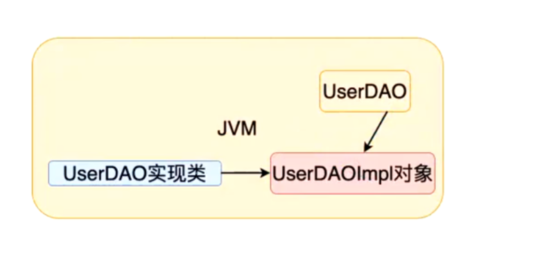
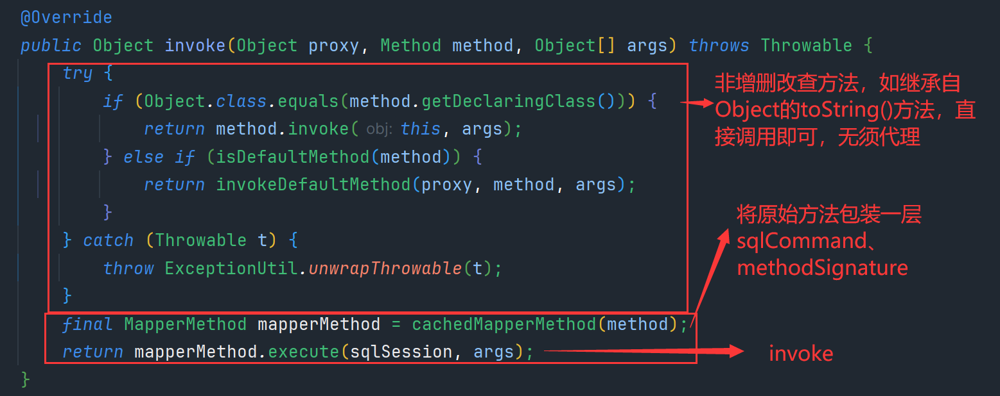

# MyBatis 源码学习

## 第一章、回顾

### 1. 课程中工具的版本

```plain
1. JDK8
2. IDEA2018.3
3. Maven3.5.3
4. MySQL 5.1.48 --> MySQL 5
   Mybatis 3.4.6
```

### 2. Mybatis开发的简单回顾

```plain
1. Mybatis做什么？
   Mybatis是一个ORM类型框架，解决的数据库访问和操作的问题，对现有JDBC技术的封装。
2. Mybaits搭建开发环境 
   1. 准备jar
     <dependency>
        <groupId>org.mybatis</groupId>
        <artifactId>mybatis</artifactId>
        <version>3.4.6</version>
     </dependency>
     <dependency>
       <groupId>mysql</groupId>
       <artifactId>mysql-connector-java</artifactId>
       <version>5.1.48</version>
     </dependency>
   2. 准备配置文件
      a. 基本配置文件 mybatis-config.xml
         1. 数据源的设置 <environments/>
         2. 类型别名
         3. mapper文件的注册
      b. Mapper文件
         1. DAO规定方法的实现 --> SQL语句 
   3. 初始化配置 
      在mybatis-config.xml文件中配置 environment
3. 开发步骤 7步
   1. entity
   2. 类型别名
   3. table 
   4. DAO接口
   5. Mapper文件
   6. Mapper文件的注册
   7. API编程
```
#### 配置文件  mybatis-config.xml

```xml
<?xml version="1.0" encoding="UTF-8" ?>
<!DOCTYPE configuration PUBLIC "-//mybatis.org//DTD Config 3.0//EN" "http://mybatis.org/dtd/mybatis-3-config.dtd">
<configuration>

    <settings>
         <setting name="cacheEnabled" value="true"/>
    </settings>


    <typeAliases>
        <typeAlias type="com.baizhiedu.entity.User" alias="User"/>
        <typeAlias type="com.baizhiedu.entity.Account" alias="Account"/>
    </typeAliases>


    <environments default="default">
        <environment id="default">
            <transactionManager type="JDBC"></transactionManager>
            <dataSource type="POOLED">
                <property name="driver" value="com.mysql.jdbc.Driver"></property>
                <property name="url" value="jdbc:mysql://localhost:3306/suns?useSSL=false"></property>
                <property name="username" value="root"></property>
                <property name="password" value="123456"></property>
            </dataSource>
        </environment>

    </environments>

    <mappers>
        <!--<package name=""-->
        <mapper resource="UserDAOMapper.xml"/>
        <mapper resource="AccountDAOMapper.xml"/>
    </mappers>


</configuration>
```
#### 核心代码分析

```plain
InputStream inputStream = Resources.getResourceAsStream("mybatis-config.xml");
SqlSessionFactory sqlSessionFactory = new SqlSessionFactoryBuilder().build(inputStream);
SqlSession sqlSession = sqlSessionFactory.openSession();

第一种：
UserDAO userDAO = sqlSession.getMapper(UserDAO.class);
List<User> users = userDAO.queryAllUsers();

第二种：
List<User> users = sqlSession.selectList("com.baizhiedu.dao.UserDAO.queryAllUsers");

--- 

两种方式功能等价 
  
那种方式好？第一种方式好 表达概念更清晰 
          第一种开发，本质上就是对第二种开发的封装。（代理设计模式）
  
```

## 第二章、Mybaits的核心对象
mybatis 是什么
1. 是通过sqlSession对JDBC进行封装 
   1. JDBC的connection、statement、ResultSet
2. 封装了SqlSessionFactory，来创建sqlSession
3. mybatis-config.xml 配置信息
4. Mapper.xml 基于此生成dao文件

### Mybatis的核心对象及其作用
1. 数据存储类对象
2. 操作类对象

#### 数据存储类对象

**概念**：在Java中（JVM)对Mybatis相关的配置信息进行封装，有如下两种配置文件：

1. mybatis-config.xml  ----> Configuration.class
2. XXXDAOMapper.xml    ----> MappedStatement(形象的认知，不准确)

#####  Configuration.class

```
   mybatis-config.xml ----> Configuration.class
      Configuration.class 的作用
         1. 封装了mybatis-config.xml 文件的内容
         	1. setting 标签内容
         	2. environment 标签内容
         	3. typeAliases 标签内容
         	4. mappers 标签内容
         2. 封装了mapper.class文件内的相关内容进行汇总，方便后续使用 
         	1. mappedStatements
         	2. caches
         	3. resultMaps
         	4. parameterMaps
         	5. keyGenerators
         3. 创建Mybatis其他相关的核心对象  newXXX()
         	1. ParameterHandler
         	2. ResultSetHandler
         	3. StatementHandler
         	4. Executor
       
```


Configuration.class类 封装 mybatis-config.xml 内容

1. setting 标签内容


##### MappedStatement.class

概念：封装Mapper文件中的一个个的配置标签（增删改查的标签，insert、delete、update等）

每一条增删改查语句，就对应一个MappedStatement 类

```md
XXXDAOMapper.xml ----> MappedStatement(形象的认知，不准确)
 
    对应的就是 Mapper文件中的一个一个的 配置标签 
    <select id. -----> MappedStatement 类1
    <insert id. -----> MappedStatement 类2

    注定 一个Mybatis应用中 N个MappedStament 对象 
    MappedStatment ---> Configuration 

    MappedStatment 中 封装SQL语句 ---> BoundSql.class (sql语句以及参数)
```


##### 小结


#### 操作类对象 sqlSession

操作对象(sqlSession)主要以下几类

1. **Excutor：**MyBatis中处理功能的核心
2. **StatmentHandler：**
3. **ParameterHandler：**
4. **ResultSetHandler：**
5. **TypeHandler：**
6. ...


##### Excutor 接口

Excutor 是Mybatis中处理功能的**核心**: 

1. 增删改update  查query
2. 事务操作：提交和回滚
3. 缓存相关的操作：cache


为什么设计出接口？

=> 所有操作、功能相关的接口，都设计为接口，方便后续扩展

Excutor 实现类：

- **BatchExcutor**

  ​		对JDBC中批处理的操作的封装， BatchExcutor 

-  **ReuseExcutor**
          目的：复用 **Statement** ，前提：参数未改变
                 insert into t_user（ID，name)values（1，‘孙帅’）；
                 insert into t_user（ID，name)values（2，‘孙帅1’）；

  ​		      上面俩就不是同一个，无法进行复用，所以 这个ReuseExcutor 还是比较苛刻的

- **SimpleExcutor**
          **最常用** Excutor Mybatis推荐 **默认** 
          Configuration：protected ExecutorType defaultExecutorType = ExecutorType.SIMPLE;


##### StatmentHandler 接口

**概念：**StatementHandler是Mybatis封装了JDBC Statement，真正Mybatis进行数据库访问操作的**核心**

**功能：**增删改差


-----

为什么Excutor 是处理核心，有update和query方法，还要再将核心封装到Statement里面？？

==>   **单一职责原则**，Excutor里有增删改查操作还有事务和缓存的操作，将核心的增删改查抽取出来statement类进行具体实现，上面Excutor只进行包装一下。

------


##### ParameterHandler.class

**目的**：参数处理 ，即：Mybatis参数 ---> JDBC 相关的参数 
             @Param ---> #、{} --- >  ?

​			

##### ResultSetHandler.class

**目的：**对JDBC中查询结果集 ResultSet 进行封装 


##### TypeHandler.class

Java程序里的类型和数据库字段的类型进行相互映射转化

Java程序操作 数据库

Java类型   数据库类型

- String    varchar
-  int       number
-  int       int


# 2. Mybatis的核心对象 如何与SqlSession建立的联系？

**Mybatis源码中的这些核心对象 在 SqlSession调用对应功能时候建立联系** 

```SqlSession.insert()
DefaultSqlSession
	->  Exctutor
		->  StatmentHandler 
SqlSession.update()
SqlSession.delete()
SqlSession.selectOne();
...
  
  
底层  SqlSession.insert()
      SqlSession.update()
      SqlSession.delete()
      ....
应用层面：
    UserDAO userDAO =  SqlSession.getMapper(UserDAO.class);
    //UserDAO接口的实现类的对象 
    //疑问？ UserDAO接口实现类 在哪里？
    //动态字节码技术 ---> 类 在JVM 运行时创建 ，JVM运行结束后，消失了 
    //动态字节码技术 
```



1. 如何 创建 UserDAO XXXDAO接口的实现类 

   --> 什么情况下使用 代理（动态代理）？

   1. 为原始对象（目标）增加【额外功能】(若非额外则用装饰器模式) 
   2. 远程代理 
      1.  网络通信 
      2. 输出传输 （RPC）Dubbo 
   3. 无中生有: 接口实现类，我们看不见实实在在的类文件，但是运行时却能体现出来。

    Proxy.newProxyIntance(ClassLoader,Interface,InvocationHandler)

2. 实现类 如何进行实现的   

   ```java
   interface UserDAO{
       List<User> queryAllUsers();         
       save(User user)
   }
   
   UserDAOImpl implements UserDAO{
       queryAllUsers(){
           sqlSession.select("namespace.id",参数)
               |-Excutor
               |-StatementHandler
               |- ParameterHandler , ResultSetHandler
               TypeHandler 
       }
       save(){
           sqlSession.insert("namespace.id",参数)
       }
   }
   ```


MyBatis 完成代理创建 核心类型 ---> 创建DAO接口的实现类 

- **MapperProxy**
  - 继承**InvocationHandler**类，执行**invoke**方法
- **MapperProxyFactory**
  - 执行**newProxyInstance** 方法 创建代理类，

```java
 MapperProxy implements InvocationHandler {
     public Class DAO接口的Class对象；
     public SqlSession SqlSession；
  
        invoke
              SqlSession.insert 
                         update
                         delete
                         selectOne
                         selectList
  
          SqlCommand:
                1. id = namespace.id
                2. type = insert | delete | select 
                          SqlSession.insert()
                          SqlSession.delete
                          ....
 }
    
```



cacheMapperMethod 对原始method 进行包装了一层。MapperMethod，内部包装了两个重要属性


```plain
 MapperProxyFactory  创建代理类
	Proxy.newProxyInstrace()
```


